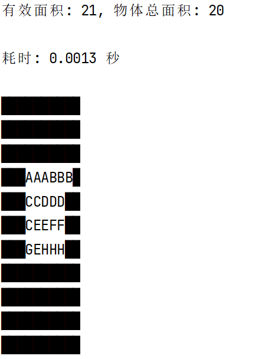
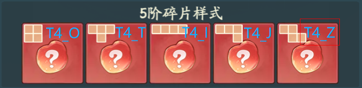
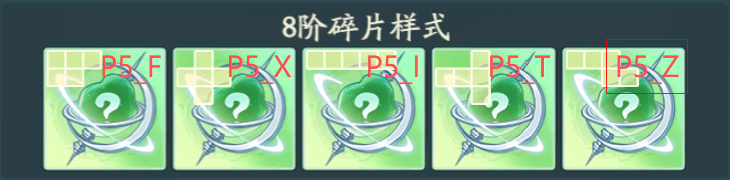

# 小世界本源
作者: 织梦山11/20服 大眼松鼠

## 环境

```bash
pip install numpy tqdm
```

## 测试
```bash
python polyomino.py
```
你会得到如下输出，对应了右图：




## 用法

### 1. 碎片填充方式

在`fill_pieces.py`填写`layout`和`pieces_input`，其中：

`layout`是你的网格，`.`表示空位，`#`表示不可填充的占位符

`pieces_input`是将要填充的各种碎片数量，符号对应如下：





```bash
python fill_pieces.py
```

### 2. 槽位解锁顺序（实验特性，仅供参考）

#### 如何评价一个网格？
我们使用这个网格能够容纳多少种不同的碎片组合作为衡量标准，比如说，

一个21格的网格，它最多能填充7个3格碎片，那么对于所有的7个3格碎片的组合（共8种），计算能够容纳哪些组合（如6种），
我们将`n3=6/8=0.75`作为一项指标。类似地可以定义`n4`和`n5`

一般来说，一个网格很难完美地填充最大数量的3格碎片，因此我们额外引入了`n3_sub`指标，
即如果少一个碎片，它能够容纳多少比例的组合。
例如21格的网格我们计算6个3格碎片的组合，类似可定义`n4_sub`和`n5_sub`

#### 运行
在`metrics.py`中自定义你的网格并选择需要的指标（如前期不需要`n5`，后期不需要`n3`），
它会输出当前网格的指标和下一个解锁槽位
```bash
python metrics.py
```
